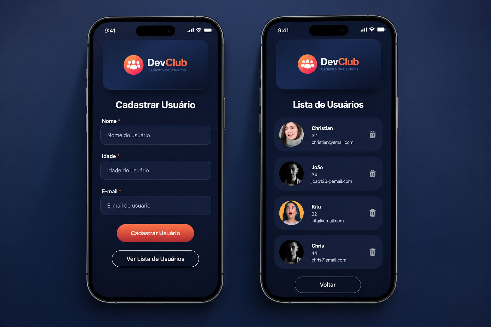

# 👥 User Management React

Aplicação desenvolvida durante os estudos de React no DevClub.

O projeto consiste em um sistema de gerenciamento de usuários, permitindo cadastrar, listar e excluir registros através de uma API desenvolvida em Node.js integrada ao MongoDB.

---

## 🖥️ Preview Desktop


---

## 📱 Preview Mobile



---

## ✨ Funcionalidades

- Cadastro de usuários
- Listagem de usuários
- Exclusão de usuários
- Navegação entre páginas utilizando React Router
- Comunicação com API REST
- Interface moderna e responsiva
- Componentes reutilizáveis

---

## 🛠 Tecnologias utilizadas

### Frontend

- React
- React Router DOM
- Styled Components
- Axios
- Vite

### Backend

- Node.js
- Express
- MongoDB
- Prisma ORM
- Cors

---

## 📂 Estrutura

```bash
src/
│
├── assets/
├── components/
├── pages/
├── routes/
├── services/
├── Styles/
└── main.jsx
```

---

## 🚀 Como executar

Clone o repositório

```bash
git clone
```

Instale as dependências

```bash
npm install
```

Execute

```bash
npm run dev
```

A aplicação estará disponível em

```
http://localhost:5173
```

---

## 🔗 Backend

A API utilizada nesta aplicação está disponível em:

👉 https://github.com/ChristianPinho/user-management-api

---

## 💡 Próximas melhorias

- Deploy da aplicação
- Deploy da API
- Banco de dados em nuvem (MongoDB Atlas)
- Validação dos formulários
- Feedback visual para erros e sucesso
- Paginação da lista de usuários
- Busca por usuários

---

## 👨‍💻 Autor

Desenvolvido por **Christian Marcel de Pinho**

LinkedIn: www.linkedin.com/in/christianpinho1994
